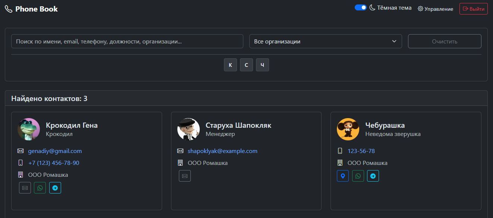

# PhoneBook - Веб-приложение телефонной книги


*Главная страница веб-приложения PhoneBook*


Веб-приложение для управления корпоративной телефонной книгой с интеграцией LDAP, картами сотрудников и почтовыми уведомлениями.

## 🚀 Основные возможности

- **📞 Телефонная книга** - просмотр и поиск контактов сотрудников
- **🔐 LDAP интеграция** - автоматическая синхронизация с Active Directory
- **🗺️ Карты сотрудников** - визуализация местоположения сотрудников на карте
- **📧 Почтовые уведомления** - уведомления о новых и измененных контактах
- **⚙️ Администрирование** - управление LDAP серверами и настройками
- **🐳 Docker поддержка** - легкий запуск в контейнерах

## 🛠 Технологии

- **Backend**: Flask 3.1.1, Python 3.8+
- **База данных**: PostgreSQL
- **LDAP**: ldap3 для интеграции с Active Directory
- **Карты**: OpenStreetMap для отображения местоположения
- **Почта**: SMTP для уведомлений
- **Кеширование**: Flask-Caching
- **Формы**: Flask-WTF
- **Миграции**: Flask-Migrate (Alembic)

## 📦 Установка и настройка

### Предварительные требования

- Python 3.8 или выше
- PostgreSQL 12+
- Docker и Docker Compose (опционально)

### 1. Клонирование репозитория

```bash
git clone <repository-url>
cd phone_book
```

### 2. Настройка виртуального окружения

```bash
python -m venv venv
source venv/bin/activate  # Linux/MacOS
# или
venv\Scripts\activate     # Windows
```

### 3. Установка зависимостей

```bash
pip install -r requirements.txt
```

### 4. Конфигурация приложения

Скопируйте файл окружения и настройте его:

```bash
cp .env.example .env
```

Отредактируйте `.env` файл:

```env
# Настройки Flask
FLASK_ENV=production
SECRET_KEY=your-very-secret-key-change-this-in-production

# Настройки авторизации
ADMIN_USERNAME=admin
ADMIN_PASSWORD=secure-password-123

# Настройки базы данных PostgreSQL
POSTGRES_DB=phonebook
POSTGRES_USER=phonebook_user
POSTGRES_PASSWORD=password123
POSTGRES_HOST=localhost
POSTGRES_PORT=5432

# URL подключения к базе данных
DATABASE_URL=postgresql://${POSTGRES_USER}:${POSTGRES_PASSWORD}@${POSTGRES_HOST}:${POSTGRES_PORT}/${POSTGRES_DB}

# Дополнительные настройки
TIME_ZONE_OFFSET=7
APP_BASE_URL=http://localhost:5050
```

### 5. Настройка базы данных

**Вариант 1: Автоматическое создание базы данных (рекомендуется)**

Программа автоматически создаст базу данных при первом запуске, если в переменных окружения указаны корректные учетные данные пользователя PostgreSQL с правами на создание баз данных.

**Вариант 2: Ручное создание базы данных**

Если вы предпочитаете создать базу данных вручную:

```sql
CREATE DATABASE phonebook;
CREATE USER phonebook_user WITH PASSWORD 'secure_password';
GRANT ALL PRIVILEGES ON DATABASE phonebook TO phonebook_user;
```

### 6. Инициализация базы данных (можно пропустить если в п.4 введены данные пользователя с правами создания БД и таблиц)

```bash
python app/create_db.py
flask db upgrade
```

### 7. Запуск приложения

```bash
python run.py
```

Приложение будет доступно по адресу: `http://localhost:5050`

## 🐳 Запуск с помощью Docker

### Создание собственного Docker образа

#### Базовый образ

Для создания стандартного Docker образа выполните:

```bash
docker build -t phonebook-app .
```


### Запуск контейнера

#### Базовый запуск

```bash
docker run -p 5050:5050 --env-file .env phonebook-app
```

#### Запуск в фоновом режиме

```bash
docker run -d -p 5050:5050 --env-file .env --name phonebook-container phonebook-app
```

### Использование Docker Compose

#### Настройка Docker Compose

Для начала работы скопируйте пример файла конфигурации:

```bash
cp docker-compose.example.yml docker-compose.yml
```

Отредактируйте `docker-compose.yml` в соответствии с вашими настройками:

- Измените пароли и секретные ключи
- Настройте переменные окружения для вашего окружения
- При необходимости добавьте дополнительные сервисы (pgAdmin и т.д.)

#### Запуск с Docker Compose

```bash
docker-compose up -d
```

#### Пересборка и запуск

```bash
docker-compose up -d --build
```

#### Остановка сервисов

```bash
docker-compose down
```


## Структура проекта
```
phone_book/
├── app/
│   ├── modules/
│   │   ├── auth_mod/          # Модуль аутентификации
│   │   ├── ldap_mod/          # Модуль LDAP интеграции
│   │   ├── mail_mod/          # Модуль почтовых уведомлений
│   │   ├── map_mod/           # Модуль карт
│   │   └── phonebook_mod/     # Основной модуль телефонной книги
│   ├── static/               # Статические файлы (CSS, JS, иконки)
│   ├── templates/            # HTML шаблоны
│   ├── config.py             # Конфигурация приложения
│   ├── models.py             # Модели базы данных
│   └── route.py              # Основные маршруты
├── migrations/               # Миграции базы данных
├── .env.example             # Пример файла окружения
├── requirements.txt         # Зависимости Python
├── docker-compose.yml       # Docker Compose конфигурация
└── Dockerfile               # Docker образ
```

## 🔒 Безопасность

- Все чувствительные данные хранятся в переменных окружения
- Используются безопасные значения по умолчанию
- Рекомендуется изменить все пароли перед использованием в продакшене
- Регулярно обновляйте зависимости для устранения уязвимостей


### Логи

Логи приложения доступны в стандартном выводе и файлах логов (если настроено).

## 🤝 Вклад в проект

1. Форкните репозиторий
2. Создайте ветку для новой функции (`git checkout -b feature/amazing-feature`)
3. Зафиксируйте изменения (`git commit -m 'Add some amazing feature'`)
4. Отправьте в ветку (`git push origin feature/amazing-feature`)
5. Создайте Pull Request

## 📄 Лицензия

Этот проект распространяется под лицензией MIT. Смотрите файл `LICENSE` для подробностей.

## 📞 Поддержка

Если у вас возникли вопросы или проблемы:

1. Проверьте документацию
2. Создайте issue в репозитории
3. Обратитесь к администратору системы

---

**Примечание**: Перед использованием в продакшене обязательно измените все пароли и секретные ключи в файле `.env`!
